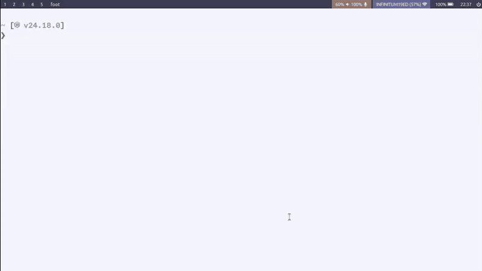

# logfine

A local-first CLI logger designed to generate structured data (JSON) perfect for AI analysis and personal trend tracking.

## Features

- Energy, MVOs (Minimum Viable Output) and logbook tracking.
- todo.txt integration & synchronization.
- Vim-like keybindings driven workflow.
- Structured querying & filtering by using a SQLite database.
- Local-first architecture ensuring offline and private usage.
- High performance & memory safety by using Rust and an ORM (via Diesel).

## Why?

The purpose of this program is to help identify patterns by keeping track of daily habits, energy levels, tasks and events.
**Helping with decision-making and externalizing memory**.


Personally, I use this tool **to ask Claude** for patterns, busywork, misalignment between my effort and output, which habits correlate with my highest energy, etc.


That's why the data can be exported to JSON and is stored in a database; **Is both human-readable and machine-readable**.



## Installation

Since *logfine* is built in Rust, you can easily compile it from source. This ensures the binary is perfectly optimized for your specific architecture and operating system.

### Prerequisites

You need to have the Rust toolchain installed on your system. If you don't have it yet, you can install it via [rustup](https://rustup.rs/):

```bash
curl --proto '=https' --tlsv1.2 -sSf https://sh.rustup.rs | sh
```

### Option 1: Install via Cargo (Recommended)

This is the cleanest way to install the CLI. It compiles the binary in release mode and automatically places it in your Cargo binary directory (usually ~/.cargo/bin/), which should be in your system's $PATH.

```bash
# Clone the repository
git clone https://github.com/damicrez/logfine.git
cd logfine

# Build and install the binary locally
cargo install --path .

# Once installed, you can run the tool from anywhere in your terminal:
logfine
```

### Option 2: Build the Binary Manually

If you just want to compile the executable file without installing it globally into your system, use the release build command:

```bash
# Clone the repository
git clone https://github.com/damicrez/logfine.git
cd logfine

# Compile in release mode (optimized)
cargo build --release
```

## Configuration

It should be located at your default configuration directory (~/.config/logfine/logfine.toml on Unix-like systems.)

Here's an explanation of every configuration item:

**logbook_path**: Directory where a sqlite database will be located.

**todo_path**: Path to your todo.txt file.

**mvos**: Is a list of strings with the *Minimum Viable Output* of your day.

**delete_tasks**: A true|false variable to delete or not delete the completed tasks in your todo.txt file.

**automatic_completion_date**: A true|false configuration variable to append completion dates when a task is marked as completed, helping following the todo.txt format.

### Example

```toml
logbook_path = "/home/username/Documents/life/"
todo_path = "/home/username/Nextcloud/todo.txt"
mvos = ["Code commit", "Zettelkasten note", "Social exposure"]
delete_tasks = true
automatic_completion_date = false
```

## Subcommands

**export**: Export the last N days of daily logs to a JSON file.

```bash
# Export the last 7 days (default) to JSON
logfine export

# Export the last 30 days to a custom output file
logfine export 30 -o monthly_report.json
```

**sync**: Synchronize tasks with the database cache without prompts.

```bash
# Sync todo.txt with the database
logfine sync

# Automatically accept detected typos during sync
logfine sync --skip-typos
```

