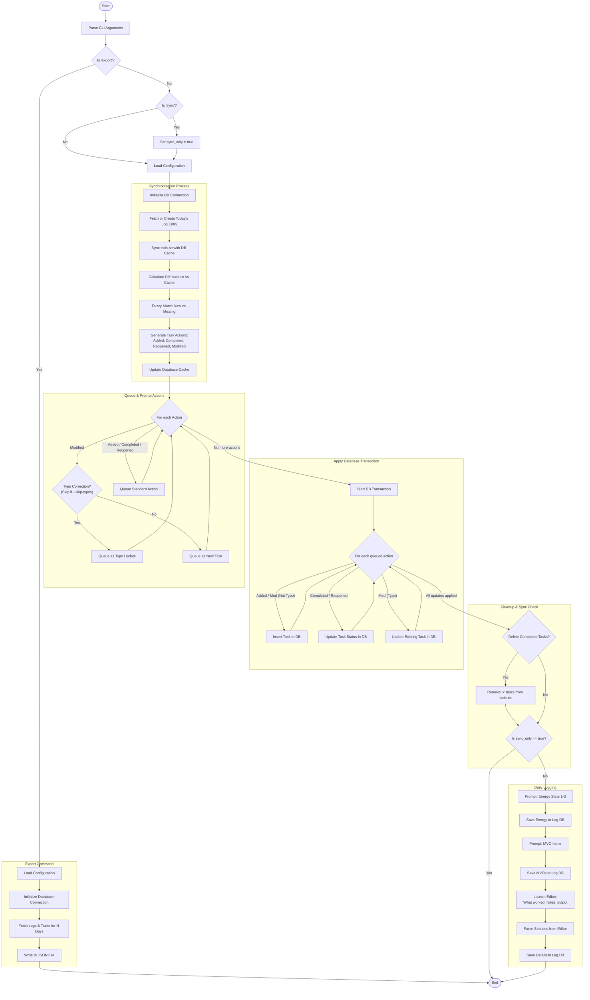

```mermaid
flowchart TD
    Start([Start]) --> ParseArgs[Parse CLI Arguments]
    ParseArgs --> IsExport{Is 'export'?}
    
    %% EXPORT BRANCH
    subgraph ExportBranch [Export Command]
        LoadConfigExp[Load Configuration]
        InitDbExp[Initialize Database Connection]
        FetchData[Fetch Logs & Tasks for N Days]
        WriteJSON[Write to JSON File]
    end

    IsExport -- Yes --> LoadConfigExp
    LoadConfigExp --> InitDbExp
    InitDbExp --> FetchData
    FetchData --> WriteJSON
    WriteJSON --> End([End])
    
    %% SETUP FOR SYNC/NORMAL
    IsExport -- No --> CheckSync{Is 'sync'?}
    CheckSync -- Yes --> SetSyncFlag[Set sync_only = true]
    CheckSync -- No --> LoadConfigNorm[Load Configuration]
    SetSyncFlag --> LoadConfigNorm
    
    %% SYNCHRONIZATION PROCESS
    subgraph SyncProcess [Synchronization Process]
        InitDbNorm[Initialize DB Connection]
        GetLog[Fetch or Create Today's Log Entry]
        CacheSync[Sync todo.txt with DB Cache]
        CalcDiff[Calculate Diff: todo.txt vs Cache]
        FuzzyMatch[Fuzzy Match New vs Missing]
        GenActions[Generate Task Actions:\nAdded, Completed, Reopened, Modified]
        UpdateCache[Update Database Cache]
    end
    
    LoadConfigNorm --> InitDbNorm
    InitDbNorm --> GetLog
    GetLog --> CacheSync
    CacheSync --> CalcDiff
    CalcDiff --> FuzzyMatch
    FuzzyMatch --> GenActions
    GenActions --> UpdateCache
    
    %% QUEUE & USER PROMPTS
    subgraph PromptQueue [Queue & Prompt Actions]
        ResolveLoop{For each Action}
        PromptTypo{"Typo Correction?\n(Skip if --skip-typos)"}
        QueueTypo[Queue as Typo Update]
        QueueNewTask[Queue as New Task]
        QueueAction[Queue Standard Action]
    end
    
    UpdateCache --> ResolveLoop
    ResolveLoop -- "Added / Completed / Reopened" --> QueueAction
    QueueAction --> ResolveLoop
    
    ResolveLoop -- "Modified" --> PromptTypo
    PromptTypo -- Yes --> QueueTypo
    PromptTypo -- No --> QueueNewTask
    QueueTypo --> ResolveLoop
    QueueNewTask --> ResolveLoop
    
    %% DATABASE TRANSACTION
    subgraph DbTx [Apply Database Transaction]
        ApplyTx[Start DB Transaction]
        ApplyLoop{For each queued action}
        InsertTask[Insert Task to DB]
        UpdateStatus[Update Task Status in DB]
        UpdateTask[Update Existing Task in DB]
    end
    
    ResolveLoop -- "No more actions" --> ApplyTx
    ApplyTx --> ApplyLoop
    
    ApplyLoop -- "Added / Mod (Not Typo)" --> InsertTask
    ApplyLoop -- "Completed / Reopened" --> UpdateStatus
    ApplyLoop -- "Mod (Typo)" --> UpdateTask
    
    InsertTask --> ApplyLoop
    UpdateStatus --> ApplyLoop
    UpdateTask --> ApplyLoop
    
    %% CLEANUP
    subgraph Cleanup [Cleanup & Sync Check]
        DelTasks{Delete Completed Tasks?}
        DeleteCompleted[Remove 'x' tasks from todo.txt]
        CheckSyncOnlyEnd{Is sync_only == true?}
    end
    
    ApplyLoop -- "All updates applied" --> DelTasks
    DelTasks -- Yes --> DeleteCompleted
    DeleteCompleted --> CheckSyncOnlyEnd
    DelTasks -- No --> CheckSyncOnlyEnd
    
    CheckSyncOnlyEnd -- Yes --> End
    
    %% DAILY LOGGING PROMPTS
    subgraph DailyLog [Daily Logging]
        PromptEnergy[Prompt: Energy State 1-3]
        UpdateEnergy[Save Energy to Log DB]
        PromptMVO[Prompt: MVO Items]
        UpdateMVO[Save MVOs to Log DB]
        LaunchEditor[Launch Editor:\nWhat worked, failed, output]
        ParseEditor[Parse Sections from Editor]
        UpdateDetails[Save Details to Log DB]
    end

    CheckSyncOnlyEnd -- No --> PromptEnergy
    PromptEnergy --> UpdateEnergy
    UpdateEnergy --> PromptMVO
    PromptMVO --> UpdateMVO
    UpdateMVO --> LaunchEditor
    LaunchEditor --> ParseEditor
    ParseEditor --> UpdateDetails
    UpdateDetails --> End
```
